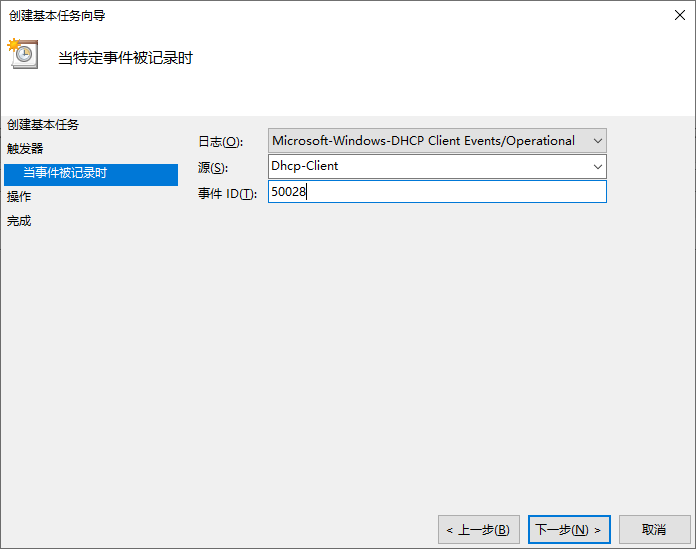
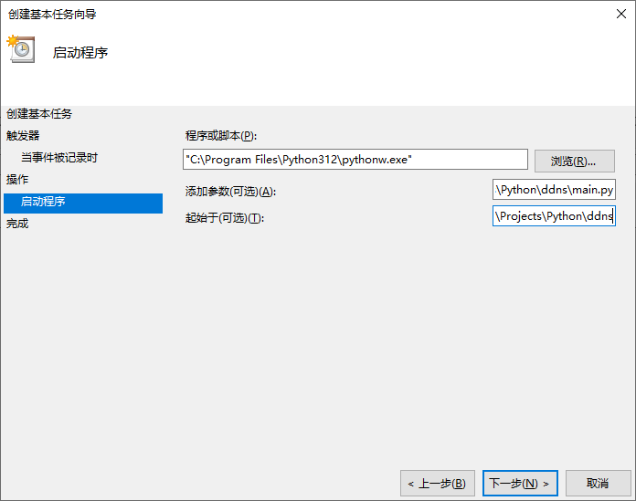
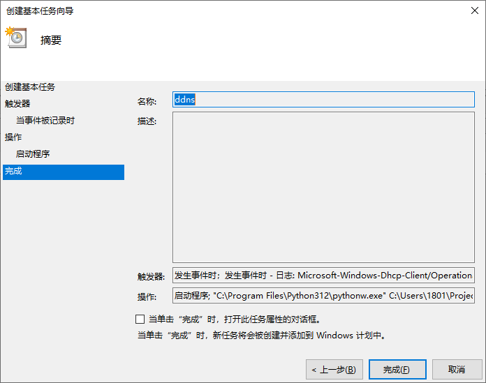

# DDNS 客户端

这是一个基于 Python 的用于 Windows 平台的动态 DNS (DDNS) 客户端，它允许您使用从本地网络接口获取的 IP 地址，通过 TSIG 认证安全地更新 DNS 'A' 记录。

## 功能特性

- **安全更新**: 使用 TSIG (Transaction SIGnature) 确保 DNS 更新请求的真实性和完整性。
- **灵活配置**: 支持通过 `config.toml` 配置文件和命令行参数进行设置。
- **自动 IP 检测**: 能够自动从指定的网络接口获取非保留的 IPv4 地址。
- **协议支持**: 支持通过 UDP 或 TCP 协议与 DNS 服务器通信。
- **日志记录**: 将操作日志同时输出到控制台和 `ddns.log` 文件，并支持 `info` 和 `debug` 两种日志级别。
- **依赖明确**: 使用 `pydantic` 进行配置管理，`dnspython` 处理 DNS 通信，`psutil` 获取网络信息。

## 安装与使用

### 预编译版本

您可以下载 [Release 页面](https://github.com/ardenet/ddns/releases) 预编译的可执行文件, 解压后修改 `config.example.toml` 文件配置程序参数并保存为 `config.toml`，然后运行 `ddns.exe` 即可推送更新。推荐使用**计划任务**来定时更新， 可参考 [Windows 计划任务](#windows-计划任务) 配置。

### 源码使用

可以采取源码直接运行或者打包后运行的方式来使用 DDNS 客户端。以下是详细步骤：

***环境要求**: Python 3.12 或更高版本。*

1. **克隆仓库**

    ```powershell
    git clone 'https://github.com/ardenet/ddns.git'
    cd ddns
    ```

1. **安装依赖**
    项目依赖项在 `pyproject.toml` 中定义。您可以使用 `uv` 或者`pip` 进行安装：

    ```powershell
    # 要使用pyinstaller进行打包，需要安装pyinstaller, 添加 `--dev` 参数；不需要则不添加dev参数，pip安装时相同
    uv sync [--dev]
    # 或
    pip install . [--group dev]
    ```

1. **直接运行或打包程序后运行**
    可以直接使用 Python 运行 `main.py` 程序，或者使用 PyInstaller 打包程序后运行。打包后的程序在 `/dist` 目录下。

    ```powershell
    pyinstaller --name ddns --onefile --noconsole main.py
    ```

## 高级配置

### 配置文件

在安装根目录下创建一个名为 `config.toml` 的文件。该文件用于配置程序的主要参数, 具体参考 [`config.example.toml`](./config.example.toml)。

### 命令行参数

您也可以通过命令行参数来运行程序，命令行参数会覆盖 `config.toml` 文件中的同名配置。

| 参数 | 描述 |
| :--- | :--- |
| `--name-server` | DNS服务器地址 |
| `--zone` | DNS区域 |
| `--hostname` | 主机名 |
| `--ttl` | DNS记录的TTL |
| `--timeout` | 连接超时时间（秒） |
| `--protocol` | 通讯协议 (`tcp` 或 `udp`) |
| `--interface` | 网络接口名称 |
| `--log-level` | 日志级别 (`info` 或 `debug`) |
| `--tsig-name` | TSIG密钥名称 |
| `--tsig-algorithm` | TSIG算法 |
| `--tsig-secret` | TSIG密钥 (Base64编码) |

### Windows 计划任务

您可以将 DDNS 客户端设置为 Windows 计划任务，以便定时更新 DNS 记录。

1. 打开 **任务计划程序** (`taskschd.msc`)。
1. 右键单击 **任务计划程序库** 并选择 **创建基本任务...**。
1. 输入任务名称和描述，**触发器(Trigger)** 选择 **当特定事件被记录时** 类型，设置日志为 **Microsoft-Windows-DHCP-Client/Operational**, 源为 **Dhcp-Client**，事件ID为 **50028** (*IP address change，IP地址更改*)。

    

    *\***注意**：如果源只有 **Dhcpv6-Client** 选项，请重新选择日志，有两个 **Microsoft-Windows-DHCP-Client/Operational**。*
1. **操作** 页面选择 **启动程序** 操作类型，输入 `ddns.exe` 的路径完成或者输入 `pythonw` 路径(*防止出现运行的黑框*), 并将**添加参数**指向 ddns 主程序的路径(*\<path to ddns\>/main.py*),将**起始于**指向 ddns 程序的项目根目录(*\<path to ddns\>*)。

    
1. 最后保存并完成创建

    

## Issues

如果您遇到任何问题，请在 [GitHub issues](https://github.com/ardenet/ddns/issues) 中提交, 如果有精力我会回复处理，不过这个项目本身就是自用的，可能没有那么多精力维护。

## 贡献教程

我们欢迎任何形式的贡献！如果您想为这个项目做出贡献，请遵循以下步骤：

1. **Fork** 本仓库。
2. 创建一个新的分支 (`git checkout -b feature/YourFeature`)。
3. 提交您的更改 (`git commit -m 'Add some feature'`)。
4. 将您的分支推送到远程仓库 (`git push origin feature/YourFeature`)。
5. 创建一个新的 **Pull Request**。
